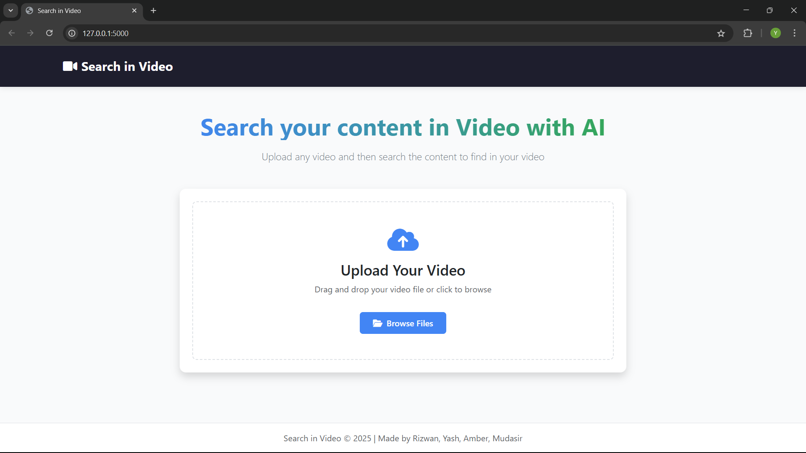

# search-in-a-video 🎥🔍🧠

A web app that lets you **search inside a video** using natural language. Just type what you're looking for — the app returns relevant **timestamps** from the video. You can also **chat with the video** to explore its content more deeply.

## ✨ Features

- 🔎 **Search by text**: Input a query, and get a list of timestamps where the topic is mentioned.
- 💬 **Chat with the video**: Have a conversation with the video content using a chatbot interface powered by LLMs.
- 🧠 **AI-powered transcription**: Uses models like Whisper or Vosk to convert speech to text.
- ⚡ **Fast and responsive**: Built with Flask and modern frontend tools for seamless UX.
- 📦 **Modular architecture**: Easily pluggable for different video and model backends.

## 📽️ How It Works

1. Upload a video.
2. The video is transcribed using speech-to-text models (e.g., Whisper/Vosk).
3. The transcript is segmented and indexed.
4. Enter a text prompt or chat query:
   - For a **search**, the app uses vector similarity to return timestamps.
   - For a **chat**, the app uses an LLM to generate context-aware responses.

## 🚀 Getting Started

### Prerequisites

- Python 3.8+
- `ffmpeg` installed
- Virtual environment (recommended)

### Clone and install

```bash
git clone https://github.com/Yash-Narnaware/search-in-a-video.git
cd search-in-a-video
python -m venv venv
source venv/bin/activate  # or venv\Scripts\activate on Windows
pip install -r requirements.txt
```

## ▶️ Run the App

To start the web application locally, follow these steps:

1. Make sure you have all dependencies installed (see [Getting Started](#-getting-started)).
2. Run the Flask app using:

```bash
python app.py
```




## 🎬 Demo Video

Watch the demo of the app in action:

[Watch the video](https://drive.google.com/file/d/1fjFBxFdir0XSKcB88zvieXRVacDJKinB/view?usp=sharing)


